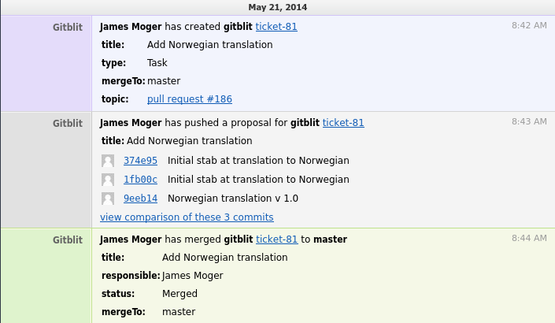

## Gitblit HipChat plugin

*REQUIRES 1.5.0*

The Gitblit HipChat plugin provides realtime integration for your HipChat team.  The plugin inject events into a room for branch or tag changes and ticket changes.

### Installation

This plugin is referenced in the Gitblit Plugin Registry and you may install it using SSH with an administrator account.

    ssh host plugin refresh
    ssh host plugin install hipchat
    ssh host plugin ls

Alternatively, you can download the zip from [here](http://plugins.gitblit.com) manually copy it to your `${baseFolder}/plugins` directory.

### Setup

At a bare minimum you'll need two settings configured in `gitblit.properties`.

    hipchat.defaultRoom = aRoom
    hipchat.defaultToken = aToken

If you have the `powertools` plugin installed, you may configure this over SSH:

    ssh host gb config hipchat.defaultRoom aRoom
    ssh host gb config hipchat.defaultToken aToken

There a handful of additional optional settings:

    hipchat.useProjectRooms = false
    hipchat.postPersonalRepos = false
    hipchat.postTickets = true
    hipchat.postTicketComments = true
    hipchat.postBranches = true
    hipchat.postTags = true

#### hipchat.useProjectRooms

*hipchat.useProjectRooms* allows you to shard Gitblit activity by the repository project.  This may fit better with any security model you may have in place.  These rooms *must* already exist in HipChat, the plugin will not create them for you.

How are project rooms named?

If project rooms are named as *hipchat.defaultRoom* -project, where *project* is the first directory element of the repository path.  If *project* is empty, the *hipchat.defaultRoom* is used.

<pre>
hipchat.defaultRoom = gb
hipchat.defaultToken = aToken
hipchat.useProjectRooms = true
hipchat.gb-network.token = 12345
</pre>

- For the *network/a/b/myrepo.git* repository, the HipChat room would be *gb-network*.
- For the *test.git* repository, the HipChat room would be *gb*.

### Usage

#### Ticket Hook

The ticket hook is automatic.

#### Receive Hook

The receive hook is automatic.

#### SSH Commands (optional)

This plugin also provides a generic mechanism to inject messages into a HipChat room.  These commands require administrator permissions.

    ssh host hipchat test
    ssh host hipchat send myroom -m "'this is a test'"

### Building against a Gitblit RELEASE

    ant && cp build/target/hipchat*.zip /path/to/gitblit/plugins

### Building against a Gitblit SNAPSHOT

    /path/to/dev/gitblit/ant installMoxie
    /path/to/dev/hipchat/ant && cp build/target/hipchat*.zip /path/to/gitblit/plugins

